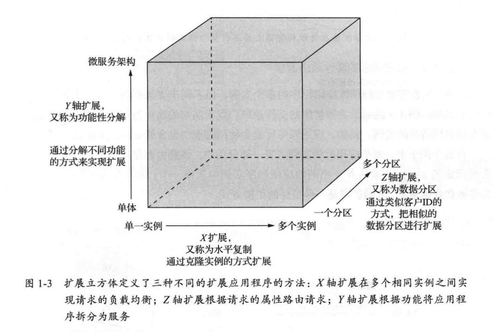

# 初识微服务

## 引入

### 单体灾难

单体架构（Monolithic Architecture）虽然开发简单、部署方便，但随着系统规模变大弊端十分明显。

* 功能模块耦合度高，代码难以维护
* 功能难以修改，牵一发而动全身
* 难以扩展，工程量大

### 救赎之道：微服务架构

#### 微服务的定义

《The Art of Scalability》描述了一个三维可拓展模型

1. **X轴扩展（Horizontal Duplication）**

> **复制系统，增加副本数量**

- 指的是**横向复制**应用程序实例（通常是无状态服务），比如部署多个服务器处理同样的流量。
- 典型方式：加机器，做负载均衡。
- 场景例子：多个 Web 服务器后面挂一台负载均衡器，流量随机分配到不同服务器。

**关键词**：副本、无状态、多实例、负载均衡

------

2. **Y轴扩展（Functional Decomposition）**

> **按功能模块拆分系统**

- 把**不同业务功能**拆成独立服务或模块，每个模块单独部署和扩展。
- 典型方式：前端、订单、支付、库存各自是独立服务。
- 场景例子：外卖系统把“用户模块”、“商品模块”、“订单模块”拆成不同微服务。

**关键词**：模块拆分、微服务、领域划分

------

3. **Z轴扩展（Data Partitioning）**

> **按数据范围拆分系统**

- 将**同一个功能模块的数据按某种规则划分**，不同的数据分配到不同的服务器。
- 典型方式：按用户 ID 取模（hash）划分，或者按地理区域划分。
- 场景例子：A~~M字母开头的用户在一批数据库，N~~Z字母开头的用户在另一批。

**关键词**：分区、分表、分库、Sharding（分片）

***微服务架构：把程序功能性分解为一组服务***

### 微服务架构的好处

简单来讲，微服务可以

1. **模块独立，开发快**

- 每个服务只做一件事，团队可以独立开发、独立上线，互不影响。

2. **扩展灵活，节省资源**

- 哪个服务压力大，就单独扩容，不用整体扩机器，更省钱。

3. **故障隔离，系统更稳**

- 一个服务出问题，只影响它自己，不会拖垮整个系统。

4. **技术栈自由**

- 每个服务可以用最适合自己的技术，比如一个用 Go 写高并发，一个用 Python 写数据处理。

5. **部署升级快**

- 小服务改动小，上线快，回滚也方便，支持敏捷开发。