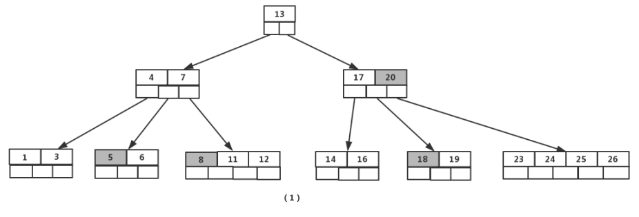
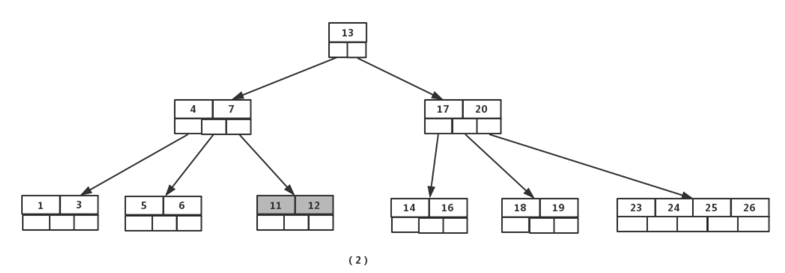
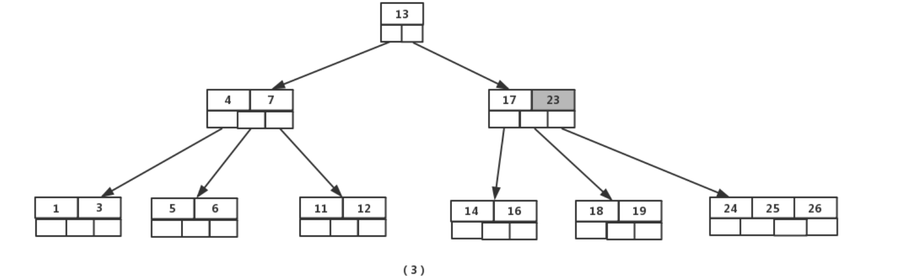
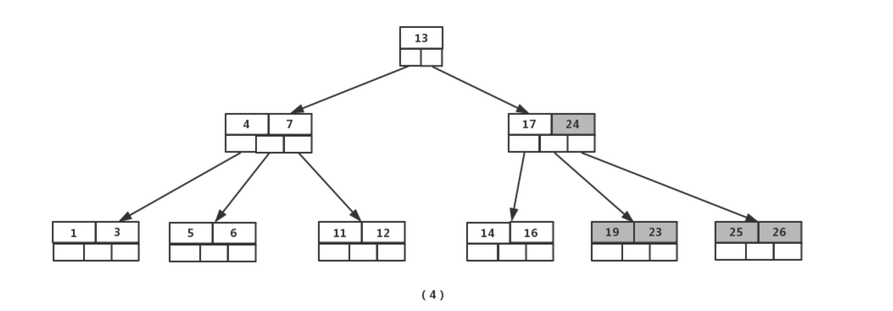
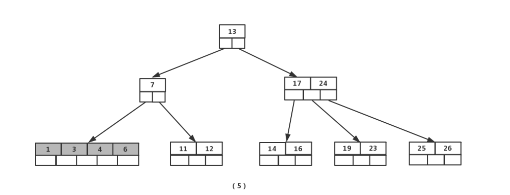
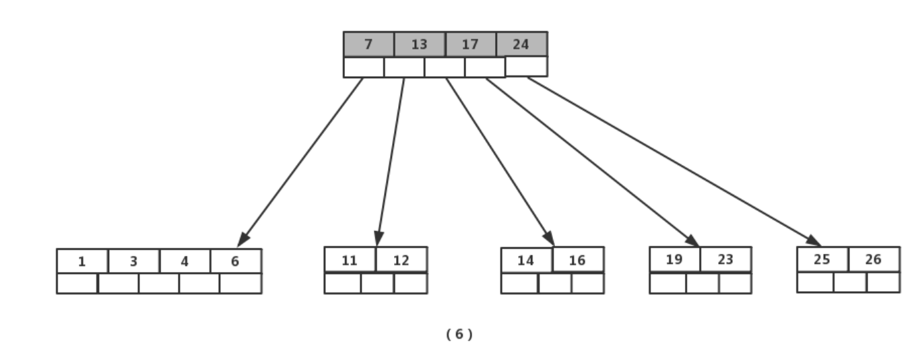

# B tree and B+ tree

## B tree

### 引入

B 树（B-tree）是一种自平衡的搜索树，能够保持数据有序。这种数据结构能够让查找数据、顺序访问、插入数据及删除的动作，都在对数时间内完成。B 树的每个节点可以拥有两个以上的子节点，因此 B 树是一种多路搜索树。

在 B 树中，有两种节点：

1. 内部节点（internal node）：存储了数据以及指向其子节点的指针。
2. 叶子节点（leaf node）：与内部节点不同的是，叶子节点只存储数据，并没有子节点。

### 性质

#### **B树**的定义

**B树**是一颗多路平衡查找树。我们描述一颗B树时需要指定它的阶数 **M** ，阶数 **M** 代表一个树节点最多有多少个查找路径，M=M路,当M=2则是2叉树,M=3则是3叉。

一棵M阶B树，有如下特性：

- 若根节点不是叶子结点，则至少有两棵树。
- 每一个节点最多M棵子树，最多有`M-1`个**关键字**（键值对）。
- 除根节点外，其他的每个分支至少有`ceil(M/2)`个子树，至少含有`ceil(M/2)-1`个关键字。
- 每个节点中的关键字都按照大小顺序排列，每个关键字的左子树的所有关键字都小于它，每个关键字的右子树都大于它。
- 所有叶子节点都位于同一层，或者说根节点到每个叶子节点的长度都相同。

一个简单的 5 阶 B 树的图例如下：


### 过程

与 [二叉搜索树](https://oi-wiki.org/ds/bst/) 类似，B 树的基本操作有查找，遍历，插入，删除。

以下的描述中，用「元素」一词指代节点内部所保存的数据。在其它的数据结构教程中，可能也会使用「关键字」、「键」、「关键码」等表述，它们的含义都相同。

#### 查找

B 树中的节点包含有多个元素。假设需要查找的是 ，那么从根节点开始，从上到下递归的遍历树。在每一层上，搜索的范围被减小到包含了搜索值的子树中。子树值的范围被它的父节点的元素确定。因为是从根节点开始的二分法查找，所以查找一个元素的代码如下：

```go
func (n *BTreeNode) Search(k int) bool {
	i := sort.SearchInts(n.keys, k)
	if i < len(n.keys) && n.keys[i] == k {
		return true
	}
	if !n.leaf {
		return n.children[i].Search(k)
	}
	return false
}
```

#### **插入**

针对m阶高度h的B树，插入一个元素时，首先在B树中是否存在，如果不存在，即在叶子结点处结束，然后在叶子结点中插入该新的元素。

- 若该节点元素个数小于m-1，直接插入；
- 若该节点元素个数等于m-1，引起节点分裂；以该节点中间元素为分界，取中间元素（偶数个数，中间两个随机选取）插入到父节点中；
- 重复上面动作，直到所有节点符合B树的规则；最坏的情况一直分裂到根节点，生成新的根节点，高度增加1；


```go
应该先Search一下节点是否存在的

// 插入操作
func (t *BTree) Insert(k int) bool{
	root := t.root
    if root.Search {//k已存在
        return false
    }
	if len(root.keys) == 2*t.t-1 {//根节点上溢出
		newRoot := NewBTreeNode(false)//建一个根节点（父节点）
		newRoot.children = append(newRoot.children, root)
		t.splitChild(newRoot, 0)//就一个孩子 index=0
		t.root = newRoot
	}
	t.insertNonFull(t.root, k)
    return true
}

func (t *BTree) NewInsertNonFull(n *BTreeNode, k int) {//只会在叶子层插入
    if n.leaf {//叶子层
		i := sort.SearchInts(n.keys, k)//找k的位置
        //i后面的数据右移1，插入k
		n.keys = append(n.keys, 0)
		copy(n.keys[i+1:], n.keys[i:])
		n.keys[i] = k
	} else {//内部节点层
		i := sort.SearchInts(n.keys, k)
		if len(n.children[i].keys) == 2*t.t-1 {//有可能会上溢出，直接分裂
			t.splitChild(n, i)
			if k > n.keys[i] {//分裂向上提了一个节点和k比较
				i++
			}
		}
		t.NewInsertNonFull(n.children[i], k)//继续向叶子层走
	}
}


// 节点分裂
func (t *BTree) splitChild(parent *BTreeNode, index int) {
	child := parent.children[index]//分裂后左子树
	newChild := NewBTreeNode(child.leaf)//分裂后右子树

	// 分裂keys
    mid := len(child.keys)//从中间分裂
    //下层key提取到parent
	parent.keys = append(parent.keys, 0)
	copy(parent.keys[index+1:], parent.keys[index:])
	parent.keys[index] = child.keys[mid]

	// 处理子节点
    newChild.keys = append(newChild.keys, child.keys[mid+1:]...)//右子树keys为[mid+1:]
    child.keys = child.keys[:mid] //左子树[:mid]

	if !child.leaf {//非叶子节点需要迁移子树，以mid为界左边给child 右边给newChild
		newChild.children = append(newChild.children, child.children[mid+1:]...)
		child.children = child.children[:mid+1]
	}
	//更新上层children（多个一个子节点）原指向节点（已修改）可以直接指向，只需加右节点即可
	parent.children = append(parent.children, nil)
	copy(parent.children[index+2:], parent.children[index+1:])
	parent.children[index+1] = newChild
}

```


#### 构建

重复插入操作

#### **删除**

首先查找B树中需删除的元素,如果该元素在B树中存在，则将该元素在其结点中进行删除；删除该元素后，首先判断该元素是否有左右孩子结点，如果有，则上移孩子结点中的某相近元素(“左孩子最右边的节点”或“右孩子最左边的节点”)到父节点中，然后是移动之后的情况；如果没有，直接删除。

- 某结点中元素数目小于（m/2）-1,(m/2)向上取整，则需要看其某相邻兄弟结点是否丰满；
- 如果丰满（结点中元素个数大于(m/2)-1），则向父节点借一个元素来满足条件；
- 如果其相邻兄弟都不丰满，即其结点数目等于(m/2)-1，则该结点与其相邻的某一兄弟结点进行“合并”成一个结点；

接下来还以5阶B树为例，详细讲解删除的动作；

- 关键要领，元素个数小于 2（m/2 -1）就合并，大于4（m-1）就分裂

  如图依次删除依次删除【8】,【20】,【18】,【5】



首先删除元素【8】，当然首先查找【8】，【8】在一个叶子结点中，删除后该叶子结点元素个数为2，符合B树规则，操作很简单，咱们只需要移动【11】至原来【8】的位置，移动【12】至【11】的位置（也就是结点中删除元素后面的元素向前移动）



下一步，删除【20】,因为【20】没有在叶子结点中，而是在中间结点中找到，咱们发现他的继承者【23】(字母升序的下个元素即直接后驱节点)（会在直接前驱和后驱后驱节点中选元素足够的），将【23】上移到【20】的位置，然后将孩子结点中的【23】进行删除，这里恰好删除后，该孩子结点中元素个数大于2，无需进行合并操作。



下一步删除【18】，【18】在叶子结点中,但是该结点中元素数目为2，删除导致只有1个元素，已经小于最小元素数目2,而由前面我们已经知道：如果其某个相邻兄弟结点中比较丰满（元素个数大于ceil(5/2)-1=2），则可以向父结点借一个元素，然后将最丰满的相邻兄弟结点中上移最后或最前一个元素到父节点中，在这个实例中，右相邻兄弟结点中比较丰满（3个元素大于2），所以先向父节点借一个元素【23】下移到该叶子结点中，代替原来【19】的位置，【19】前移；然【24】在相邻右兄弟结点中上移到父结点中，最后在相邻右兄弟结点中删除【24】，后面元素前移。



最后一步删除【5】， 删除后会导致很多问题，因为【5】所在的结点数目刚好达标，刚好满足最小元素个数`ceil(5/2)-1=2`,而相邻的兄弟结点也是同样的情况，删除一个元素都不能满足条件，所以需要该节点与某相邻兄弟结点进行合并操作；首先移动父结点中的元素（该元素在两个需要合并的两个结点元素之间）下移到其子结点中，然后将这两个结点进行合并成一个结点。所以在该实例中，咱们首先将父节点中的元素【4】下移到已经删除【5】而只有【6】的结点中，然后将含有【4】和【6】的结点和含有【1】,【3】的相邻兄弟结点进行合并成一个结点。



也许你认为这样删除操作已经结束了，其实不然，在看看上图，对于这种特殊情况，你立即会发现父节点只包含一个元素【7】，没达标（因为非根节点包括叶子结点的元素K必须满足于2=<K<=4，而此处的K=1），这是不能够接受的。如果这个问题结点的相邻兄弟比较丰满，则可以向父结点借一个元素。而此时兄弟节点元素刚好为2，刚刚满足，只能进行合并，而根结点中的唯一元素【13】下移到子结点，这样，树的高度减少一层。



代码：

```go

// 删除操作入口
func (t *BTree) Delete(k int) {
	t.deleteFromNode(t.root, k)
	// 处理根节点键空的情况
	//Case 4:根节点下溢出，直接释放根节点即可
	if len(t.root.keys) == 0 && !t.root.leaf {
		t.root = t.root.children[0]
	}
}

// 递归删除主逻辑
func (t *BTree) deleteFromNode(n *BTreeNode, k int) {
	i := sort.SearchInts(n.keys, k)

	// Case 1: 键在当前节点
	if i < len(n.keys) && n.keys[i] == k {
		if n.leaf {
			// Case 1a: 直接从叶子删除
			n.keys = append(n.keys[:i], n.keys[i+1:]...)
		} else {
			// Case 1b: 内部节点删除
			t.deleteInternal(n, i)
		}
	} else {
		// Case 2: 键不在当前节点
		if n.leaf {
			return // 键不存在
		}
		// 确定子节点路径
		end := len(n.keys)
		if i == end {
			i-- // 防止越界
		}
		child := n.children[i]
		// Case 3: 确保子节点有足够的元素
		if len(child.keys) < t.t {
			t.fillChild(n, i)
		}
		// 递归删除
		t.deleteFromNode(child, k)
	}
}

// 处理内部节点删除
// 所有内部节点的删除都转化为叶子节点的删除
func (t *BTree) deleteInternal(n *BTreeNode, i int) {
	k := n.keys[i]

	// Case 1b1: 左子节点有足够的元素
	leftChild := n.children[i]
	if len(leftChild.keys) >= t.t {
		pred := t.getPredecessor(leftChild)
		n.keys[i] = pred
		t.deleteFromNode(leftChild, pred)
		return
	}

	// Case 1b2: 右子节点有足够的元素
	rightChild := n.children[i+1]
	if len(rightChild.keys) >= t.t {
		succ := t.getSuccessor(rightChild)
		n.keys[i] = succ
		t.deleteFromNode(rightChild, succ)
		return
	}
	//有可能下溢出就直接合并
	// Case 1b3: 合并左右子节点
	t.mergeChildren(n, i)
	t.deleteFromNode(leftChild, k) //合并到了左子树
}

// 获取前驱键
func (t *BTree) getPredecessor(n *BTreeNode) int {
	for !n.leaf {
		n = n.children[len(n.children)-1]
	}
	return n.keys[len(n.keys)-1]
}

// 获取后继键
func (t *BTree) getSuccessor(n *BTreeNode) int {
	for !n.leaf {
		n = n.children[0]
	}
	return n.keys[0]
}

// 补充子节点键数不足
func (t *BTree) fillChild(parent *BTreeNode, i int) {
	child := parent.children[i]

	// Case 3a: 向左兄弟借键
	if i > 0 {
		leftSib := parent.children[i-1] //左兄弟
		if len(leftSib.keys) >= t.t {
			// 父节点下移键
			child.keys = append([]int{parent.keys[i-1]}, child.keys...) //加到最前面
			parent.keys[i-1] = leftSib.keys[len(leftSib.keys)-1]        //左子树最后元素上移
			// 转移子节点指针
			if !leftSib.leaf { //非叶节点要将子树转移到child（最前面）
				child.children = append([]*BTreeNode{leftSib.children[len(leftSib.children)-1]}, child.children...)
				leftSib.children = leftSib.children[:len(leftSib.children)-1] //转移后删去子树
			}
			leftSib.keys = leftSib.keys[:len(leftSib.keys)-1]
			return
		}
	}

	// Case 3b: 向右兄弟借键
	if i < len(parent.children)-1 {
		rightSib := parent.children[i+1]
		if len(rightSib.keys) >= t.t {
			// 父节点下移键
			child.keys = append(child.keys, parent.keys[i])
			parent.keys[i] = rightSib.keys[0]
			// 转移子节点指针
			if !rightSib.leaf {
				child.children = append(child.children, rightSib.children[0])
				rightSib.children = rightSib.children[1:]
			}
			rightSib.keys = rightSib.keys[1:]
			return
		}
	}

	// Case 3c: 合并操作
	if i > 0 {
		t.mergeChildren(parent, i-1)
	} else {
		t.mergeChildren(parent, i)
	}
}

// 合并相邻子节点
func (t *BTree) mergeChildren(parent *BTreeNode, i int) {
	//将右子树与左子树合并到左子树中
	left := parent.children[i]
	right := parent.children[i+1]

	// 合并键
	left.keys = append(left.keys, parent.keys[i]) //父节点下移
	left.keys = append(left.keys, right.keys...)  //合并

	// 合并子节点指针
	if !left.leaf { //非叶节点子树迁移
		left.children = append(left.children, right.children...)
	}

	// 调整父节点
	parent.keys = append(parent.keys[:i], parent.keys[i+1:]...)               //删除父节点
	parent.children = append(parent.children[:i+1], parent.children[i+2:]...) //删除子树
}
```


## B+ tree

### 引入

`B+树`是一种数据结构，是一个N叉排序树，每个节点通常有多个孩子，一棵`B+树`包含根节点、内部节点和叶子节点。根节点可能是一个叶子节点， 也可能是一个包含两个或两个以上孩子节点的节点。

`B+树`通常用于数据库和操作系统的`文件系统`中。NTFS、ReiserFS、NSS、XFS、JFS、ReFS和BFS等文件系统都在使用`B+树`作为元数据索引。`B+树`的特点是能够保持数据稳定有序， 其插入与修改拥有较稳定的对数时间复杂度。`B+树`元素自底向上插入。

### 性质

#### B+树的定义

`B+树`是应文件系统所需而出的一种`B-树`的变型树。一棵`m阶`的`B+树`和m阶的`B-树`的差异在于：

**1)** 有n棵子树的节点中含有n个关键字(即每个关键字对应一棵子树)；

**2)** 所有叶子节点中包含了全部关键字的信息， 及指向含这些关键字记录的指针，且叶子节点本身依关键字的大小自小而大顺序链接；

**3)** 所有的非终端节点可以看成是索引部分，节点中仅含有其子树（根节点）中的最大（或最小)关键字

**4)** 除根节点外，其他所有节点中所含关键字的个数必须`>=⌈m/2⌉`(注意： `B-树`是除根以外的所有非终端节点至少有`⌈m/2⌉`棵子树)

下图是所示为一棵3阶的`B+树`，通常在`B+树`上有两个指针头， 一个指向根节点，另一个指向关键字最小的叶子节点。因此，可以对`B+树`进行两种查找运算： 一种是从最小关键字起顺序查找，另一种是从根节点开始，进行随机查找。

#### 特性

- 所有关键字都出现在叶子节点的链表中（稠密索引），且链表中的关键字恰好是有序的；
- 不可能在非叶子节点命中；
- 非叶子节点相当于叶子节点的索引（稀疏索引），叶子节点相当于是存储（关键字）数据的数据层；
- 更适合文件索引系统；


## B tree，B+ tree，二分查找树，自平衡二叉树

### 什么是二分查找树？

* 二叉树
* 左子树的所有结点小于该节点
* 右子树的所有节点大于该节点

问题：

* 极端情况下二分查找树会退化为链表（插入的元素一直递增就会出现这种情况）

* 不能范围查询

* 随着元素的加入，树高会快速增加

### 自平衡二叉树

为了解决二分查找树退化成链表的问题，有人提出[AVL树](https://zh.wikipedia.org/zh-cn/AVL%E6%A0%91)

AVL树在二分查找树的基础上加了一个约束：

***左子树和右子树的高度差不能超过1***

PS:感兴趣的也可以去了解一下[红黑树](https://zh.wikipedia.org/wiki/%E7%BA%A2%E9%BB%91%E6%A0%91)

另外的两个问题没有解决

于是就出现了B树和B+树

### B树和B+树性能上的区别


1. 单点查询

   B树最快情况下可以O(1)查询到数据，平均来看B树会比B+树快一些

   但是区别不是很大

2. 插入和删除效率

   B+树有大量冗余的节点（也是一种弊端），删除时可以直接删除不怎么需要懂内部节点

   B树就不一样了，插入删除操作已经讲过，对树结构的影响比较大

3. 范围查询

### MYSQL中的B+树

MySOL的存储方式根据存储引擎的不同而不同，我们最常用的就是Innodb 存储引擎，它就是采用了B+树作为了索引的数据结构。
下图就是 Innodb 里的 B+ 树:


但是 Innodb 使用的 B+ 树有一些特别的点，比如:
Innodb 根据索引类型不同，分为聚簇和二级索引。他们区别在于:
因为表的数据都是存放在聚簇索引的叶子节点里所以InnoDB 存储引擎一定会为表创建一个聚簇索引，且由于数据在物理上只会保存一份，所以聚簇索引只能有一个，而二级索引可以创建多个。

下面详细稍微讲一下聚簇索引和二级索引

#### 聚簇索引和二级索引

另外，索引又可以分成聚集索引和非聚集索引(二级索引)，它们区别就在于叶子节点存放的是什么数据:
聚集索引的叶子节点存放的是实际数据，所有完整的用户记录都存放在聚集索引的叶子节点;
二级索引的叶子节点存放的是主键值，而不是实际数据，
因为表的数据都是存放在聚集索引的叶子节点里，所以 InnoDB 存储引擎一定会为表创建一个聚集索引，且由于数据在物理上只会保存一份，所以聚簇索引只能有一个。
InnoDB 在创建聚簇索引时，会根据不同的场景选择不同的列作为索引:
如果有主键，默认会使用主键作为聚簇索引的索引键;
如果没有主键，就选择第一个不包含 NULL 值的唯一列作为聚簇索引的索引键;在上面两个都没有的情况下，InnoDB 将自动生成一个隐式自增 id 列作为聚簇索引的索引键;
-张表只能有一个聚簇索引，那为了实现非主键字段的快速搜索，就引出了二级索引(非聚簇索引/辅助索引)，它也是利用了 B+树的数据结构，但是二级索引的叶子节点存放的是主键值，不是实际数据，
级索引的 B+树如下图，数据部分为主键值:


因此，**如果某个查询语句使用了二级索引，但是查询的数据不是主键值，这时在二级索引找到主键值后，需要去聚簇索引中获得数据行，这个过程就叫作「回表」，也就是说要查两个 B+树才能查到数据。不过，当查询的数据是主键值时，因为只在二级索引就能查询到，不用再去聚簇索引查，这个过程就叫作「索引覆盖」，也就是只需要查一个 B+树就能找到数据。**

#### 非聚簇索引（mysql中的，和InnoDB中的概念不同）

这里介绍的非聚簇索引是指MyISM引擎中的非聚簇索引，不是InnoDB引擎中的非聚簇索引（二级索引结构也为非聚簇索引结构）。

（1）非聚簇索引是一种索引方式，MyISM采用的是非聚簇索引，其索引文件结构为B+Tree结构。索引文件和数据文件是分离的。索引文件存储B+Tree结构，数据文件存储表中的数据行。

（2）索引文件是按照索引键值和表数据内存地址构建的B+Tree，其结构的叶子节点存储了索引列的值和指向数据文件中记录的物理位置（通常磁盘地址）的指针。

（3）每个索引对应一个B+Tree结构的索引文件，索引文件是独立的。通过辅助索引检索时，无需访问主键索引树。

（4）执行查询时，会利用非聚簇索引中的索引列值对B+Tree从根节点逐层查找，找到叶子节点。从叶子节点中获取记录的物理位置（磁盘地址）找到数据文件，从数据文件中获取响应的记录。当索引覆盖扫描时，可以直接从索引文件中返回这些值，无需再访问数据文件。
